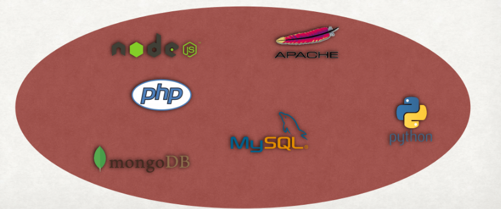
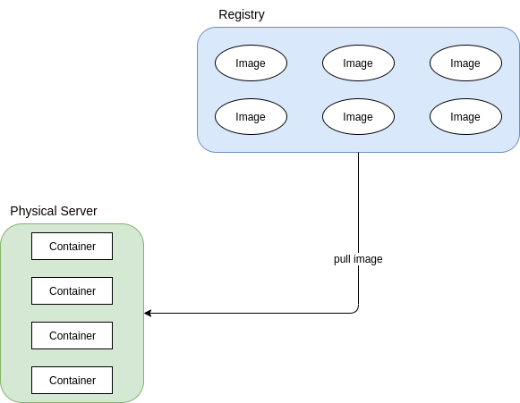
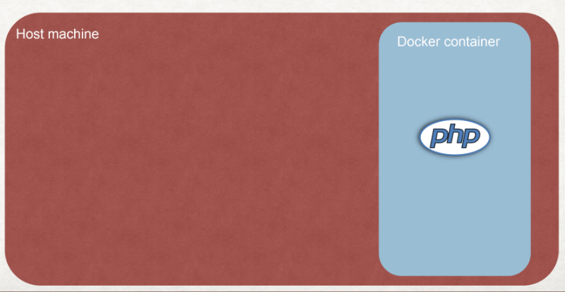
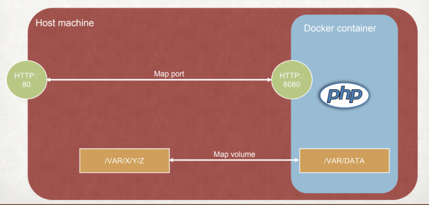
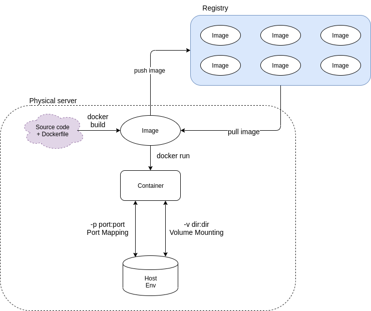

# Docker tutorial

### Prerequisite

* [Docker CE](https://docs.docker.com/engine/installation/)
* [Docker-compose](https://docs.docker.com/compose/install/)

**Note**: Docker compose might already be included within Docker CE. So after install Docker CE, you should run `docker-compose version` to check if it was installed or not.

To check if installation was success, run these command

```
docker version
docker-compose version
```

### Slide

https://www.dropbox.com/s/fh3feiht35l5xx6/docker.pptx?dl=0

### App Description

This is a simple api with express js and mongo db

Endpoints:

* `GET /`: should return "Hello world".
* `GET /list`: should return a list of item
* `GET /list/add/:name`: should add a new item to list

### Table of Content
- What is Docker?
- Basic concepts of Docker
- Running an application using Docker
- Containerize your application

### What is Docker?

#### Describe the situation

- Your Company start with a simple stack:
  - Apache + MySQL + PHP
- Several months later, your boss require to have a new stack:
  - Python tensor flow
- You need to upgrade your environment
  - From Python 2 to Python 3

After a while, your environment will look like this


#### The Problem

**in brief**
Multiple apps shared same OS environment and it's hard to change/install new env and/or new app

**in full**
- Time consuming when setup a new stack

- Environment conflict between stacks (not isolated) 
  eg nodejs installed and broken by upgrading other stuff
  by `not isolated` it means not isolated stacks aka. stacks shared same dependencies
  
- Missing dependencies
- Hard to upgrade (code + environment)
- Hard to replicate to another machine
- ...

#### Introduction to Docker

- Docker was introduced in 2013
- For easier to understand, Docker is **similar to VM but dont consume as much computing resources**
- Docker allow application run in an isolated environment
- Docker provide an easy way to install and share your application

#### Basic concept of Docker

- Docker image: a snapshot of current machine (As concept it is similar to a GHOST Image / Backup Image of computer)
- Docker container: a running Image
- Docker registry: a centralize repository of Docker Image



##### Practice

- Running a Docker container
```bash
# Run a container
docker run -d                            --name mongo        mongo
           # run as background daemon    # container name    # image name at hub.docker.com/_/mongo

# List running containers
docker ps
sample_output='
CONTAINER ID        IMAGE    COMMAND                  CREATED             STATUS              PORTS                                                                                         NAMES
fb93ea67f4f1        mongo    "docker-entrypoint.s…"   4 minutes ago       Up 4 minutes        27017/tcp
'

# View logs of a container
docker logs mongo

# Stop a container
docker stop mongo

# Remove a container
docker rm mongo

# View cpu/memory consumed
docker stats  # similar to htop

```

##### Docker-compose

- A Configuration-way for running docker containers

```yaml
version: "3.7"

services:
  db:
    image: mongo
    container_name: "mongo"
```

- Running:
```bash
# Running a single service
docker-compose up -d mongo

# Running all services
docker-compose up -d
```

#### Fundamental of Docker environment

- Two entity:
  - Docker environment: environment of Docker application
  - Host OS environment: environment of the physical server running Docker
- Docker application run in a ISOLATED ENVIRONMENT with server host
  - Isolated network
  - Isolated file system
- Docker environment is **DESTROYED** whenever application stopped



- Docker provide 2 method for communicate between Docker environment and host OS
  - Port Mapping: For network communication
  - Volume Mount: For file system communication




#### Advice
- Should limit 1 service/app per container, avoid adding multiple services into 1
  i.e. Docker auto-restart a crashed container --> 1app-1container will help keeping all app alive

- Docker have its own mechanism for process monitoring and restart, so better avoid adding to the container monitor-things like `supervisord`, `pm2`, ...

##### Practice
```bash
docker run -d --name mongo -p 27017:27017 -v ./data/mongo:/data/db mongo
```

#### Containerize your application

- Creating `Dockerfile` and `.dockerignore`

- Running `docker build -t {image_name}:{image tag} .`

- `Docker image` is stored as multiple `layer`
  
  + Docker will **reuse** old layer if command or content does not change
  e.g. 
  `FROM node:alpine` will be stored as a layer and reused whenever image node:alpine is required
  and this `FROM` command marked with `---> Using cache`
  
  + layer for `COPY` command is considered new layer if file content is new
  + layer for `RUN`  command is considered new layer if command call's whole text is new
  
- Reuse layer for **faster docker build process**
  + carefully order your dockerfile commands so that maximize the number of reused layers will give you the fastest image build time

#### Summary


